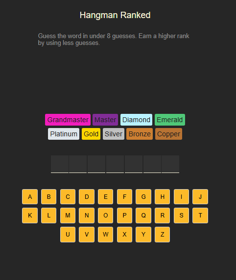
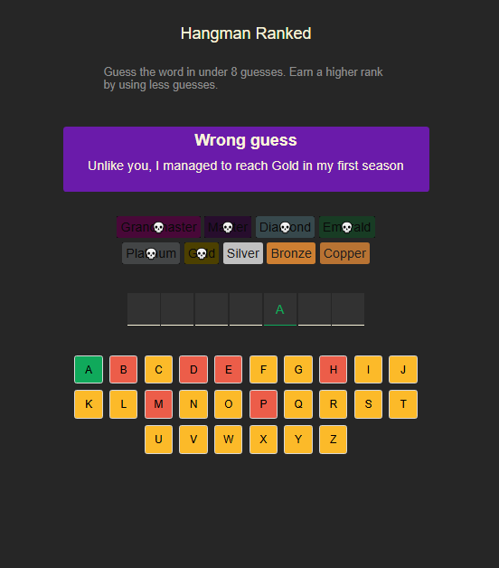
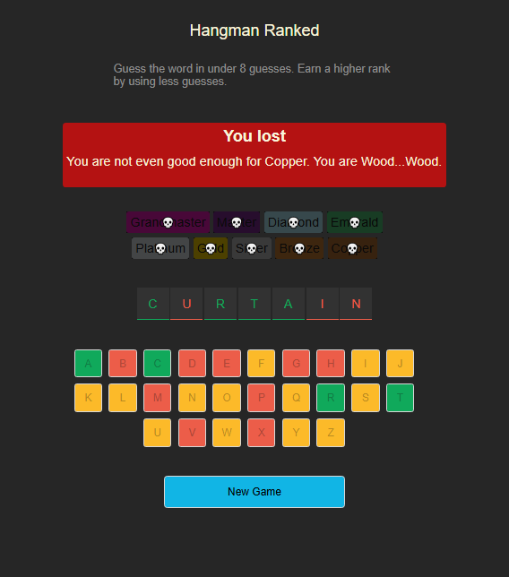
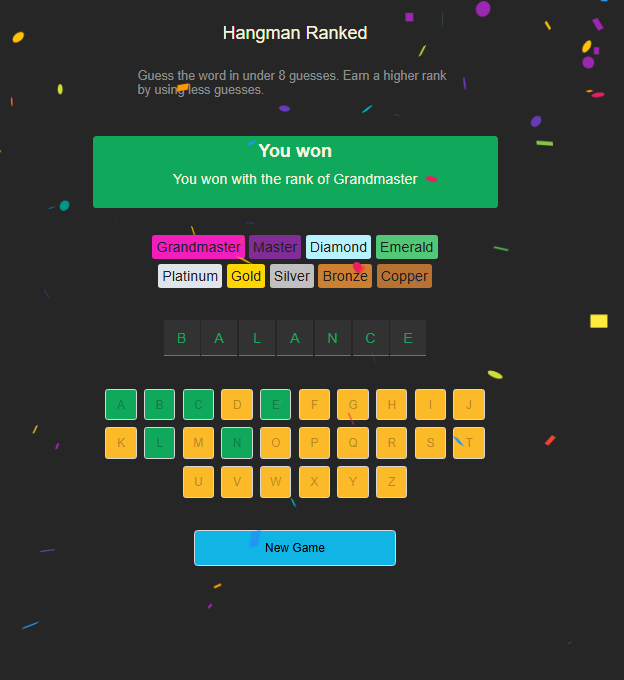

# Sebastian Riedel Portfolio

Welcome to my portfolio! Here you'll find some of the web projects I've built.

---

### Hangman Game
**Description:**  
This app generates a game of Hangman. The basic principal of the game is to guess the hidden word with as few guesses as possible. The user can click different letter buttons so check if the button is included in the hidden word. The user will get feedback if he hit or missed a letter. The game is lost if too many wrong letters were guessed. The game is won if the user guesses the correct hidden word.

**GitHub Repo:** [Link to repo](https://github.com/SebastianR0589/hangman_game_project)

**Screenshots:**

**Features:**
- Generate a new hidden word
- Interactively let the user guess the hidden word
- Gives feedback if the game was won or lost

**Tech Stack:**  
React, react-confetti, clsx
