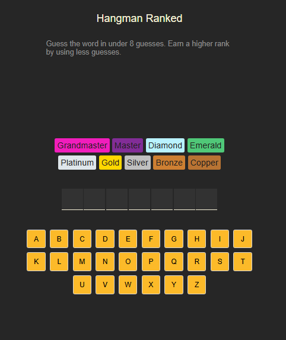
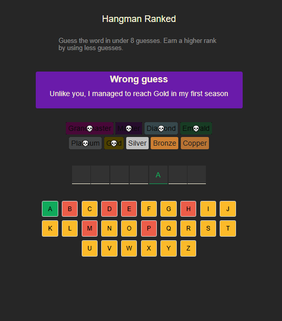
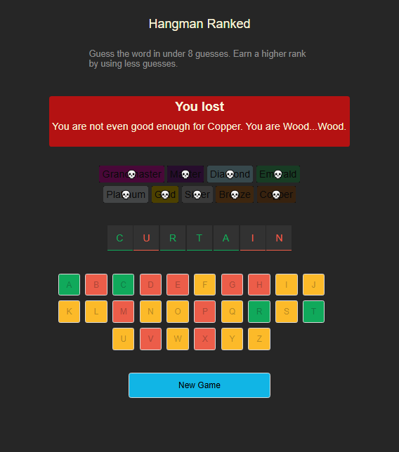
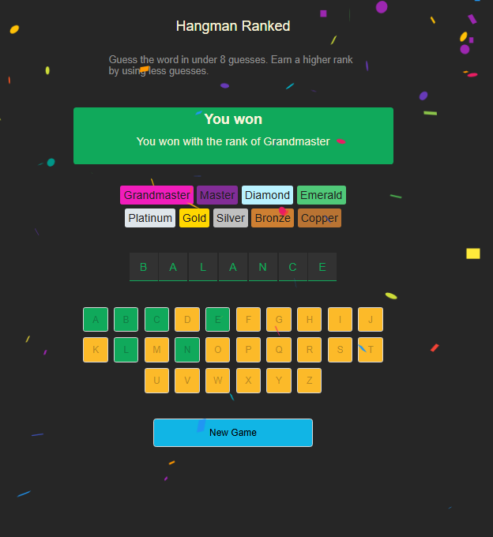

# Sebastian Riedel Portfolio
# Hangman Game

This project is a React-based interactive game inspired by the classic Hangman game. The goal is to guess the hidden word with as few attempts as possible. Players select letters, receive instant feedback if the letter is correct or incorrect, and aim to reveal the entire word before reaching the maximum number of wrong guesses.

The application demonstrates state management, component-based architecture, conditional rendering, and user feedback handling in a React environment.

---

## Project Goals
- Practice React state management and dynamic UI updates  
- Implement interactive components and conditional rendering  
- Provide user feedback through animations and UI changes  
- Explore component reusability and clean project structure  

---

## Features
- Generate a new random hidden word for each game  
- Interactive letter selection with immediate feedback  
- Track correct and incorrect guesses  
- Display win or loss feedback, enhanced with animations (react-confetti)  
- Clean and responsive UI design  

---

## Tech Stack
- React  
- JavaScript / TypeScript (depending on your implementation)  
- react-confetti  
- clsx for conditional class management  

---

## Screenshots

---

## Repository
GitHub Repository: [Link to repo](https://github.com/SebastianR0589/hangman_game_project)
